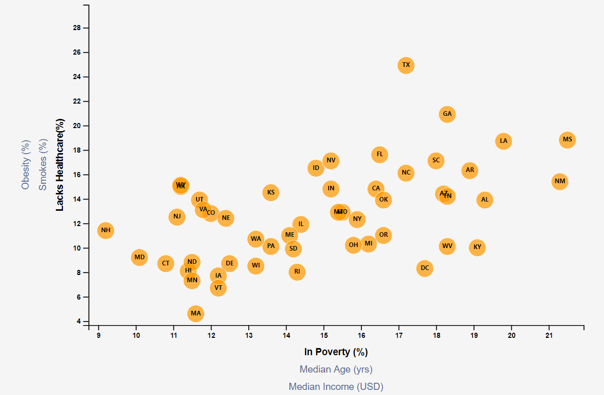

# Interactive graph using SVG and D3.js

## Background

Using data from U.S. Census Bureau and the Behavioral Risk Factor Surveillance System, aim is to produce a interactive svg scatter plot that compares Poverty, Age and Income against healthcare, smoker% and obesity %

The data set included with the assignment is based on 2014 ACS 1-year estimates: [https://factfinder.census.gov/faces/nav/jsf/pages/searchresults.xhtml](https://factfinder.census.gov/faces/nav/jsf/pages/searchresults.xhtml). The current data set incldes data on rates of income, obesity, poverty, etc. by state. MOE stands for "margin of error."

### Step 1: Creating the initial plot layout

From the provided csv file, create a first-level scatter plot using Poverty% and Lack of Healthcare%.

Key aspects of the scatter are
* Include state abbreviations in the circles.

* axes and labels to the left and bottom of the chart.
----

### Level 2: Add Animation to the scatter

#### 1. In this step, include more demographics and more risk factors. 
* Additional labels placed in the scatter plot and click events attached so that users can decide which data to display. 
* Animate the transitions for your circles' locations as well as the range of the axes. 

* X Axis will be Poverty, Age and Income. Y Axis will be Lacks Healthcare, Smoker and Obesity

#### 2. Incorporate d3-tip

 Add tooltips to the circles and display each tooltip with the data that the user has selected. Note: use of d3-tip plugin

- - -
